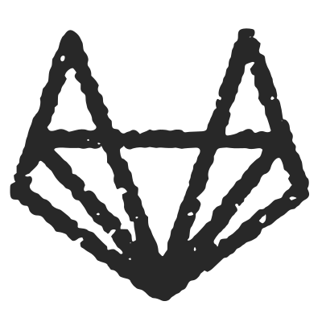
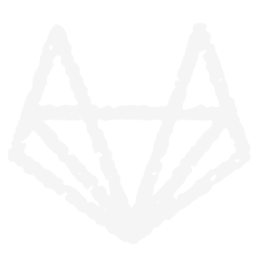

## Hi, I'm Maria

[🇧🇷](README.PT.md) Português

  

### About me

- 📌 Belo Horizonte, Brazil
- 🎓 Statistician by Universidade Federal de Minas Gerais
- 🖥️ Data Scientist
- 🐈 Stray cats lover
- 🧚🏻‍♀️ Aspiring cosplayer
- 🧵 I also love embroidery, sewing, painting and knitting

 

---

### Technologies & Languages

**I'm good at and confortable with:** 

 
 

**I'm still learning but I can get by with:**

 
 

**I don't use much anymore but I've worked with:**

 
 
 

---

### You can also find me here

 

